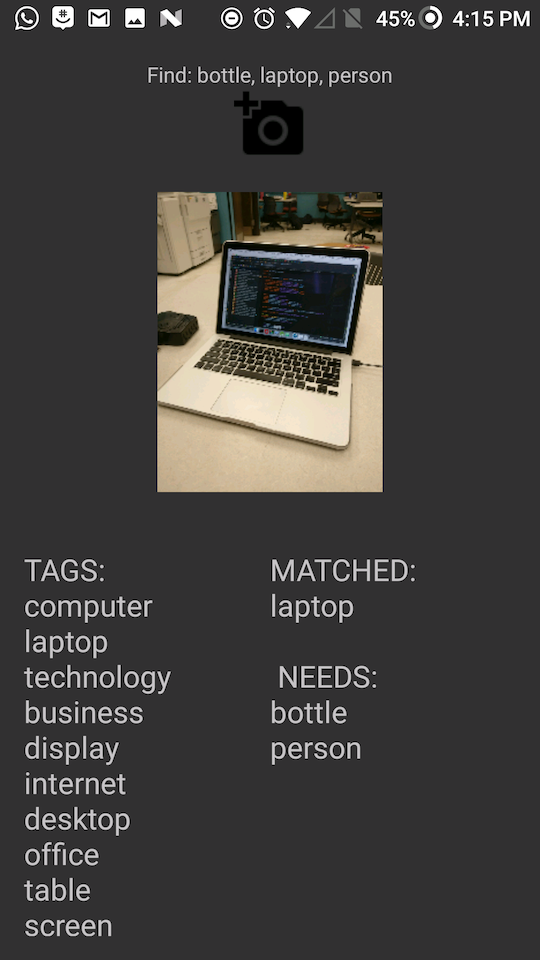

# Simon Says

Simons Says is a scavenger hunting game for your Android smartphone. You will be given a list of things to look, then you will follow by taking pictures of the things in the list to complete the hunt. This is done thanks to the Image Recognition software provided by Clarifai, which will output different type of tags based on the picture that was sent. Image will not be save in memory in order to keep the app faster.

## Screenshots
 

 

 

## Authors
- Christian Chiang (cdcf@iastate.edu)
- Ben Holmes (btholmes@iastate.edu)
